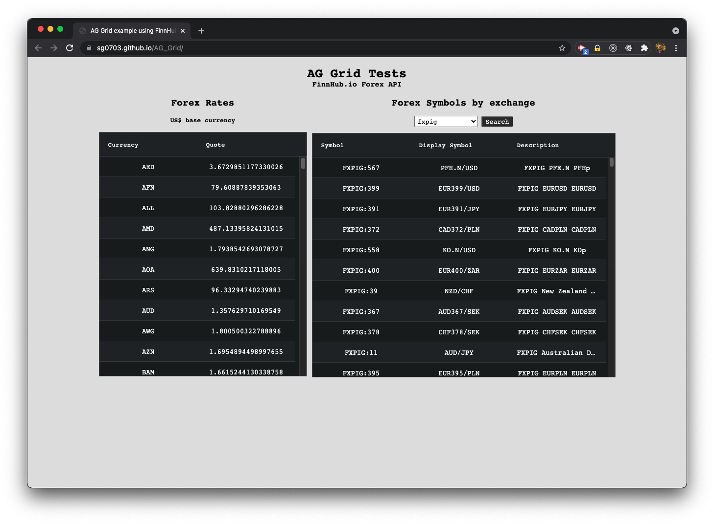

# AG Grid Practice

## Description

I created this simple app to practice with AG Grid. I used FinnHub.io's forex API. The page displays current forex rates for the US dollar on one grid.

The app queries FinnHub to determine which exchanges are currently available and populates a dropdown menu. When users select an exchange and click "search", the second grid is populated with forex symbols and information about those symbols.

## License

Copyright (c) Sam Gates. All rights reserved.
Licensed under the [MIT](https://opensource.org/licenses/MIT) license.

## Questions

Check out my [GitHub Profile](https://github.com/sg0703). Email with questions! You can reach me at sam.j.gates@gmail.com.
